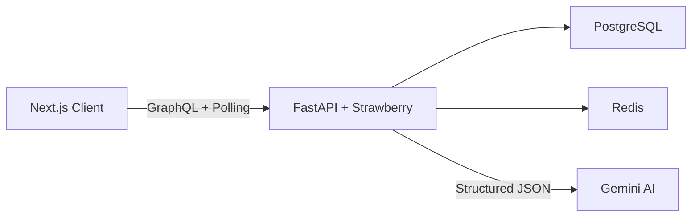
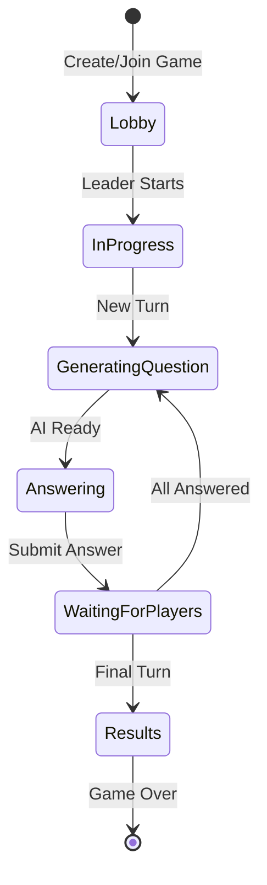

# Finance Game

**A multiplayer life simulation where every financial decision shapes your future**


Finance Game is a turn-based multiplayer game where players navigate life's financial decisions across different age stages. AI-generated scenarios adapt to each player's history, creating unique storylines. No account needed — jump in with an anonymous session or sign in with Google.

## Architecture



## Features

- **AI-Generated Scenarios** — Gemini creates personalized financial dilemmas based on each player's age group and decision history
- **Multiplayer Lobbies** — Create a game, share the code, and play with friends in real-time
- **Turn-Based Gameplay** — Players progress through life stages (childhood → retirement), making choices that affect their score
- **Dual Authentication** — Full JWT auth for registered users, plus anonymous session tokens for instant play
- **Live Game State** — Frontend polls every 500ms for seamless multiplayer synchronization
- **Leaderboard & Results** — Final rankings with AI-generated life summaries for each player
- **Google OAuth** — Optional account linking for persistent game history
- **Canvas Confetti** — Celebratory animations for winners

## Tech Stack

| Layer | Technologies |
|-------|-------------|
| **Frontend** | Next.js 15, React 19, TypeScript, Apollo Client, Zustand, Tailwind CSS 4, Motion |
| **Backend** | FastAPI, Strawberry GraphQL, SQLAlchemy 2.0 (async), Alembic, Pydantic |
| **AI** | Google Gemini 2.5 (structured JSON output for questions and life summaries) |
| **Database** | PostgreSQL 15, Redis 7 |
| **Auth** | JWT tokens + anonymous participant sessions, Google OAuth 2.0, bcrypt |
| **DevOps** | Docker, Docker Compose |

## Screenshots

> _Screenshots coming soon_

## Getting Started

### Prerequisites

- Python 3.11+ with [Poetry](https://python-poetry.org/)
- Node.js 18+
- Docker & Docker Compose
- Google Gemini API key

### 1. Start infrastructure

```bash
docker compose up -d
```

This starts PostgreSQL and Redis.

### 2. Backend setup

```bash
cd backend
cp .env.example .env
# Fill in your secrets (especially GEMINI_API_KEY)

poetry install
alembic upgrade head
uvicorn app:app --reload --port 8000
```

The GraphQL API will be available at `http://localhost:8000/graphql`.

### 3. Frontend setup

```bash
cd frontend
cp .env.example .env

npm install
npm run dev
```

The app will be available at `http://localhost:3000`.

## Game Flow



1. **Leader creates a game** and shares the join code
2. **Players join the lobby** (with or without an account)
3. **Leader starts the game** — AI generates the first scenario
4. **Each turn**: players receive personalized questions and choose from multiple options
5. **Between turns**: intermediate leaderboard shows current standings
6. **Final round**: AI generates a life summary for each player based on all their choices
7. **Results**: podium rankings with scores

## API Overview

**Key operations:**

| Domain | Operations |
|--------|-----------|
| **Auth** | `register`, `login`, `googleAuth`, `refreshTokens` |
| **Game** | `createGame`, `startGame`, `getGame`, `getGameByCode` |
| **Participation** | `joinGame`, `getParticipants` |
| **Turns** | `advanceTurn`, `markTurnReady`, `getCurrentTurn` |
| **Choices** | `submitChoice`, `getChoices`, `getQuestions` |
| **Results** | `getGameResults`, `getLeaderboard` |

## Project Structure

```
finance-game/
├── docker-compose.yml          # Local dev infrastructure
├── backend/
│   ├── app/
│   │   ├── ai/                 # Gemini client, prompts, generation
│   │   ├── config/             # Configuration management
│   │   ├── models/             # SQLAlchemy ORM (game, turns, questions, choices)
│   │   ├── repositories/       # Data access layer
│   │   ├── services/           # Game logic, auth, AI integration
│   │   ├── graphql/
│   │   │   ├── mutations/      # Game management, turn progression
│   │   │   ├── queries/        # Game state, results
│   │   │   └── schema.py
│   │   └── utils/              # Auth, DB, logging helpers
│   ├── alembic/                # Database migrations
│   └── pyproject.toml
└── frontend/
    ├── src/
    │   ├── app/                # Next.js App Router
    │   │   ├── auth/           # Login/signup/OAuth
    │   │   └── game/           # Game pages (lobby, question, results)
    │   ├── features/
    │   │   ├── game/           # Game containers and UI components
    │   │   └── auth/           # Authentication forms
    │   └── shared/             # Apollo client, stores, hooks
    └── package.json
```
